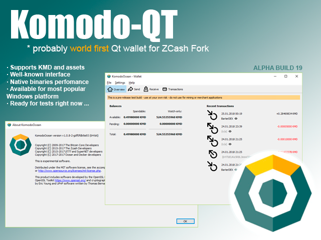
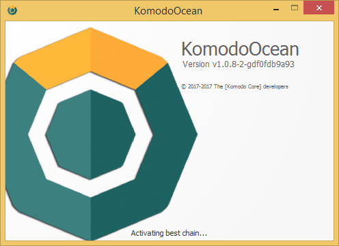
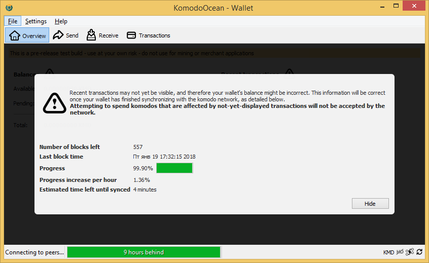
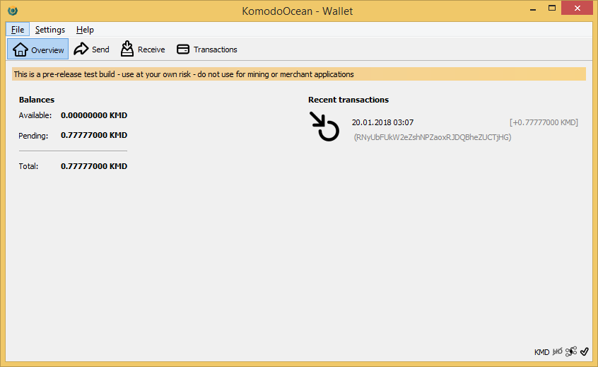
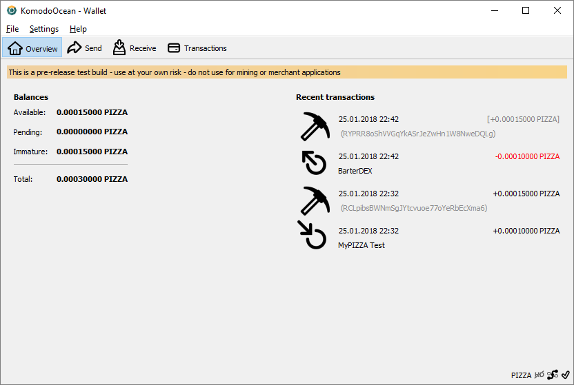

## KomodoOcean (komodo-qt) ##



This is *early alpha* of KomodoOcean / komodo-qt GUI qt-based wallet for Komodo (KMD). Probably (not sure) is a **world first Qt-Wallet** for ZCash based cryptocurrency forks. Now it available only for Windows (64-bit) platform, but in future with community help we have plan to build it for all three OS (Windows / Linux / MacOS).



### System requirements ###

- Windows 8 / 8.1 / 10 (64-bit) based PC.
- At least 4 Gb of RAM (8 or 16 Gb RAM recommended).
- About 3.1 Gb of storage space to sync full blockchain (SSD drive is recommended)

Before you start create the following configuration file, named `komodo.conf` in %APPDATA%\Komodo folder:

    rpcuser=bitcoinrpc
    rpcpassword=password
    txindex=1
    addnode=5.9.102.210
    addnode=78.47.196.146
    addnode=178.63.69.164
    addnode=88.198.65.74
    addnode=5.9.122.241
    addnode=144.76.94.38
    addnode=89.248.166.91

And download [sprout-proving.key](https://z.cash/download/sprout-proving.key) and [sprout-verifying.key](https://z.cash/download/sprout-verifying.key) in %APPDATA%\ZcashParams folder. If you already have installed original komodod.exe (console daemon) for Windows, or Agama Wallet - you already have all needed. 

Alternative download links for ZcashParams:

- https://agama.komodoplatform.com/file/supernet/sprout-proving.key
- https://agama.komodoplatform.com/file/supernet/sprout-verifying.key

For more information about Komodo Platform, please visit official site: [https://komodoplatform.com/](https://komodoplatform.com/) . Also you can follow original jl777's komodo repo on GitHub - https://github.com/jl777/komodo .

### Project Status ###

Currenly komodo-qt is *under developement*. Use it at your own risk - do not use for mining or merchant applications, also we don't recommend now to use it with your main wallet. Before use you can copy your main wallet.dat in a secure place or use `-datadir` command-line key to select other data folder for use with komodo-qt.





Supported (tested) features:

- Launching GUI interface and syncing blockchain.
- Faster blockchain indexes loading in compare with original komodod for Windows. Estimated speed of loading fully synced blockchain indexes on KMD is **50 sec.** on Core i7-6700K / 64 Gb RAM / SSD drive, that approaches speed of Linux PC with same hardware.
- Receiving and sending coins.
- Extended coin control features, selecting "Inputs..." (UTXOs) when sending coins.
- Supporting assetchains (launch KomodoOceanGUI.exe with needed `-ac_name`, `-ac_supply` and `-addnode` command-line keys to launch wallet on needed assetchain).
- Correct quit from app (earlier versions of komodo-qt wasn't correct shutdown all of running threads).


Existing issues:

- If you are syncing blockchain first time, estimated time and percentage of loading blocks not showed in status bar. But app is syncing at that moment, this is "checkpoints" related issue, right now any checkpoints is absent in original Komodo sources, so, app couldn't determine current percentage of blockchain loading (we are working on this issue). So, if you start sync blocks first time on your PC - just wait some time when it finished.
- Default Tx Fee now is *0.00005000 KMD*, instead of standart fee 0.00001000 KMD. Some options on Transaction Fee tab related to choose fee doesn't affect real tx fee. We already know about this issue and will solve it in future releases. 

### Version History ###

- **Alpha Build 20** (1/26/2018)

	- Improovements in handling assets.
	- Fixed labels when displaying assets, now if komodo-qt started with `-ac_name` key currency name will be equal to launched asset name (next screenshot shows how it looks on PIZZA asset).
	- Added launch_assets folder with *.cmd batch files for launching assets.

	

- **Alpha Build 19** (1/24/2018)

	- First version with build Release versions of *.exe and *.dll , previous issues from Build 16 and 18 were successfully fixed. Now this is *fastest* release that ever. Loading block index stage tooks only `1 min. 58 sec.` from fully synced blockchain and seems it's a little but **faster than a Linux** version on same PC (*Core i7-7700 / 8 Gb RAM / SSD*). 
	
	If you want to help us in perfomance measuring, sync blockchain, close the wallet and open it again. Wait for loading wallet and main screen with Balances and Recent transactions appears. After open your log file in `%APPDATA%\debug.log` and copy following lines:

    ```
    2018-01-24 19:41:56 LoadBlockIndexDB: starting...
    2018-01-24 19:41:56 komodo_statefname
    2018-01-24 19:41:56 komodo_stateupdate: komodostate loaded...
    2018-01-24 19:41:56 komodo_stateupdate: komodostate parsed...
    2018-01-24 19:41:56 fname.(C:\Users\User\AppData\Roaming\Komodo\komodostate) fpos.8089827
    ...
	2018-01-24 19:43:15 LoadBlockIndexDB: loaded block index guts...
	2018-01-24 19:43:16 LoadBlockIndexDB: sorted...
    2018-01-24 19:43:17 LoadBlockIndexDB: last block file = 13
    2018-01-24 19:43:17 LoadBlockIndexDB: last block file info: CBlockFileInfo(blocks=20019, size=95281106, heights=662443...677743, time=2018-01-12...2018-01-23)
    2018-01-24 19:43:17 Checking all blk files are present...
     
    ```

	It will show perfomance (time) of loading blocks on your PC. Post your resuls and PC configuration in Issues section, Slack channel #komodo or Telegram group. Thx in advance.

- **Alpha Build 18** (1/24/2018)

	In this release we abandoned global changes from Build 16 and now it's stable.

	- Reverting all global changes with CWallet, CWalletDB, CDB classes.
	- High CPU load usage in ThreadFlushWalletDB was fixed by other way, ThreadFlushWalletDB thread still exists in source and was untouched.
	- Source code clean-up and reassessment.
	- Fixed copyrights in Help -> About window.
	- Added `IsMine` and `Watch-only` columns in Receiving addresses list (it's very useful to determine which addresses belongs to your wallet if you are added some watch-only addresses via `importaddress` command or if you are using [BarterDEX](https://www.komodoplatform.com/en/technology/barterdex)).
	- All binaries were reverting to Debug versions, because release version of *.exe and *.dll's have several networkng issues.


- **Alpha Build 16** (notes)

	During investigate issues with syncing new blocks and some errors during sending and receiving transactions we decided to hide Build 16 binaries from public, until all issues will be solved. Seems, we need to revert global changes with Wallet and Wallet DB related classes. We are working on this and will release new build as fast as possible. Currently you can use latest build from releases section. 

- **Alpha Build 16** (1/23/2018)

	This is important / *singnificant release* with some major changes, because of this all standart functions needs to be re-tested with increased attention.

	- Wallet and Wallet DB related classes (such as CWallet, CWalletDB, CDB), some RPC and Init procedures was *cardinally* rewritten and partially derived from Bitcoin Core sources. This cause source code more logic and readable, also it was fixed some issues, included high CPU usage in some cases. 
	- Earlier found issue with high CPU load in ThreadFlushWalletDB (this thread was used to close wallet.dat file if it hasn't been used in 500ms) was fixed by removing ThreadFlushWalletDB and using CScheduler for wallet flushing.
	- Source code clean-up.
	- Fixed displaying connected peers list in Help -> Debug window -> Peers.
	- Allow banning selected peers from GUI (also in Help -> Debug window -> Peers).
	- Solved issue with File -> Backup wallet function that was failed in some cases. Now wallet backup from GUI should work correctly.
	- All binaries from this release (*.exe, *.dll) have *Release* version, instead of *Debug*. Using release version of binaries compiled with speed optimizations cause komodo-qt works *faster* than earlier. 
	- Other speed optimizations. Now komodo-qt loads blocks index from fully synced blockchain in 6 mins on Core i7-6700k / 16 Gb / SSD drive, earlier it tooks 10-11 mins. So, now we have **x2** faster loading blocks.
	- Fixed some minor issues.  

**p.s.** If you are experiencing some problems with using this build, plz report about it in Issues section and just temporary use previous build until all confirmed issues will be fixed.


- **Alpha Build 13** (1/21/2018)

	- Fixed some minor issues.
	- Fixed displaying number of in/out connections in Debug Window -> Information tab.
	- Fixed displaying number of current connections in status bar. Clicking on network activity icon in status bar to start/stop network activity now works correctly.  


- **Alpha Build 12** (1/19/2018) - First public release. 

### How to run? ###

Just unpack latest release from [releases section](https://github.com/DeckerSU/komodo-qt/releases) and run KomodoOceanGUI.exe . If you find any issues or have a questions, please, use the issues section of this repo to contact us.

### FAQ ###

**Q.** Is the source-code of this project will be available?

**A.** Yes, of course. After we will fix all major issues with the application and alpha-test period is over, we will publish source code here or will provide a link to download it.

**Q.** Am i understand correctly that this is only for Windows?

**A.** Yes, right now we are working on Windows version of Qt-wallet. It was compiled with Visual Studio 2015 and haven't build scripts for other compilers, like MinGW. Also, right now it can't be built for Linux or MacOS. But when we publish sources - you can join this project and help us to build Linux and MacOS versions.

We don't use any specific Windows routines in our code, so, various parts of code derived from komodod or bitcoin-core is still cross-platform and in future we only need to develope build-scripts for other OS.

**Q.** When you are planning to publish sources?

**A.** Right after alpha-test period is over. Unfortunatelly, you can't join to developement right now. We don't want to publish any sources until of major issues will be fixed. But you can help us with testing current version and reporting about founded issues. We do our best to approximate the day of publishing sources, but our main aim is to release stable and fully functionally application without any major issues.

**Q.** Where i can find "absent" builds? For example, i see in releases section *Build xx*, but no binaries for it?
**A.** In releases sections you can find only *stable* releases, it means that the release exist in History of changes, but was deleted from releases section - it was contains some major issues and was excluded from public. Some releases with issues was marked us for internal use and will not avilable in public. Every release you can find in releases sections is already tested and shouldn't contain any major issues. 

### Developers of Qt wallet ###

- Main developer: [@Ocean](https://komodo-platform.slack.com/team/U8BRG09EV)
- IT Expert / Sysengineer: [@Decker](https://komodo-platform.slack.com/messages/D5UHJMCJ3)
